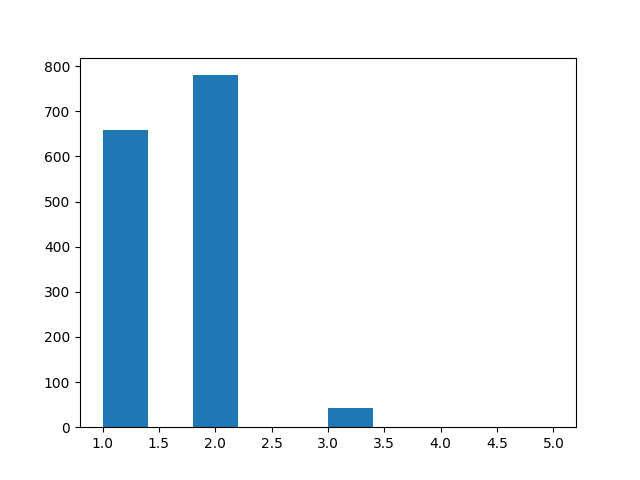
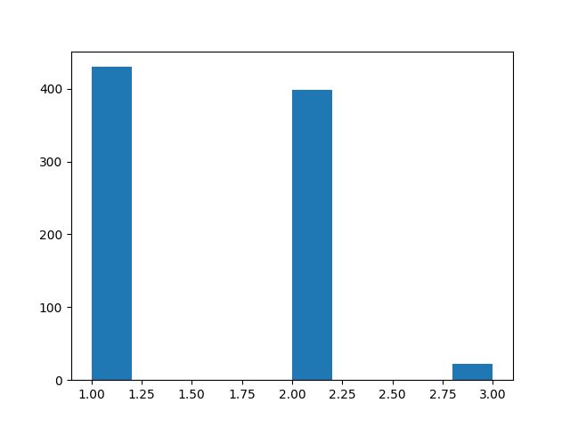

# 1. word counts in each name




train
```
# occurence	percentage
2:    780	52.596089
1:    658	44.369521
3:     43	2.899528
4:      1	0.067431
5:      1	0.067431
```

test
```
# occurence	percentage
2:    398	46.823529
1:    430	50.588235
3:     22	2.588235
```

